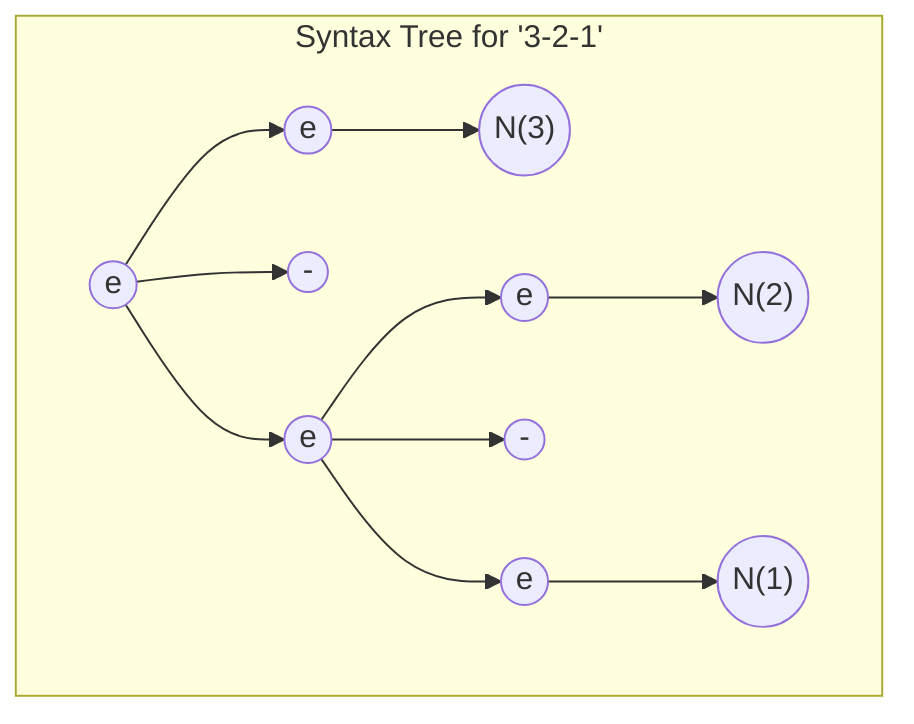
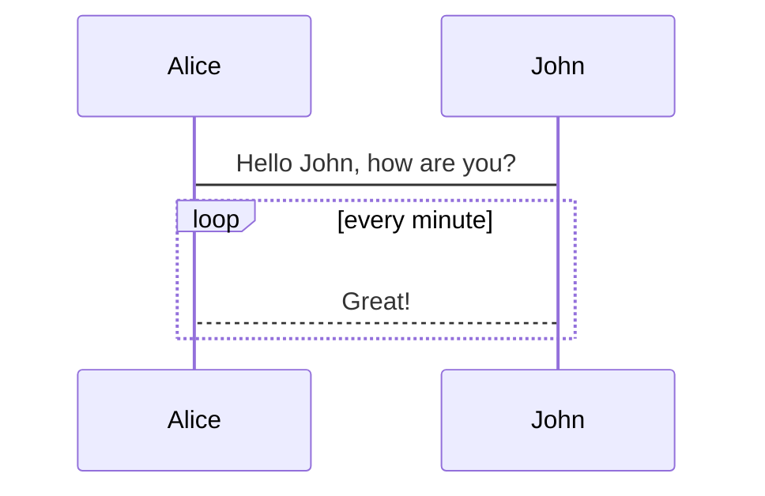

## Table Component

See <https://xaksis.github.io/vue-good-table/guide/#installation>

<Tabla></Tabla>


## Social Share Component

<social-share :networks="['wechat', 'qq', 'twitter', 'facebook', 'weibo', 'email', 'pinterest']" />

## mermaid

<https://www.npmjs.com/package/vuepress-plugin-mermaidjs>






<mermaid>
stateDiagram
    [*] --> Still
    Still --> [*]
    Still --> Moving
    Moving --> Still
    Moving --> Crash
    Crash --> [*]
</mermaid>

## Check vuepress-plugin-flowchart

<https://jchou24.github.io/VueJCBlog/Usage/Markdown/flow-chart.html#flowchart>

A simple diagram describing the Stylus compiler’s compilation order as follows:

<br>

@startuml

[*] --> State1
State1 --> [*]
State1 : this is a string
State1 : this is another string

State1 -> State2
State2 --> [*]

@enduml

## Check Global Vars Plugin


{{ $var.google_plus}}

```yml
---
sidebar: auto
published: true
google: "https://currents.google.com/u/1/communities/101901734024125937720"
---
```

{{ $frontmatter }}

## MathJax Plugin

* One `$` and `$$` works 

The absence of the curly brackets make the formula to go in a separated line

When $a \ne 0$

But 

When $a\ne{}0$, there are two solutions to \(ax^2 + bx + c = 0\) and they are


$$x = {-b \pm \sqrt{b^2-4ac} \over 2a}.$$

$\LaTeX \text{ inline}$

The default $w=1$ reduces... ✔️

## Page Variables

<div style="color:white" class="language-js">
<pre>
{{ $page }}
</pre>
</div>

## Site Variables

<div style="color:white" class="language-js">
<pre>
{{ $site}}
</pre>
</div>

## Vue

[Inserting vue as an static asset](/solution.html)