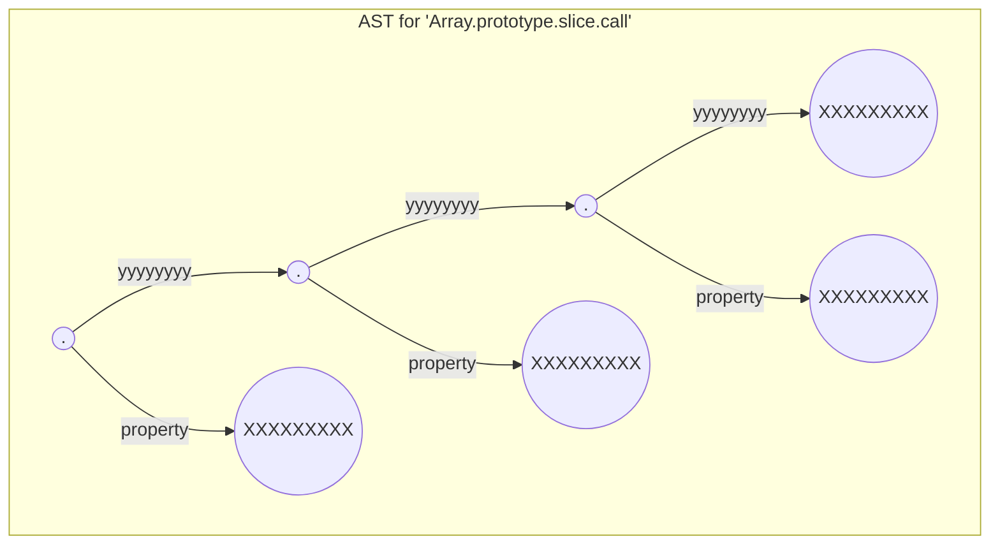

Exercise:

```mermaid
graph TB
  subgraph AST for 'Array.prototype.slice.call'
    A((.))-->|"yyyyyyyy"| B((.))
    A-->|"property"| F(("XXXXXXXXX"))
    B-->|"yyyyyyyy"| C((.))
    B-->|"property"| G(("XXXXXXXXX"))
    C-->|"yyyyyyyy"| D(("XXXXXXXXX"))
    C-->|"property"| E(("XXXXXXXXX"))
  end
```

