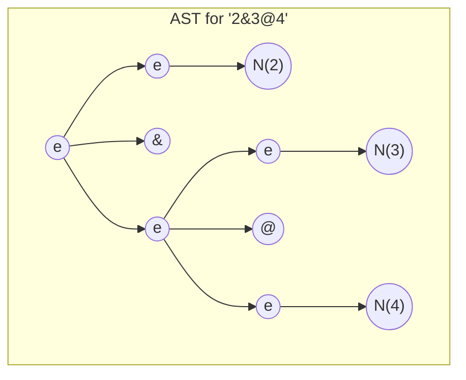
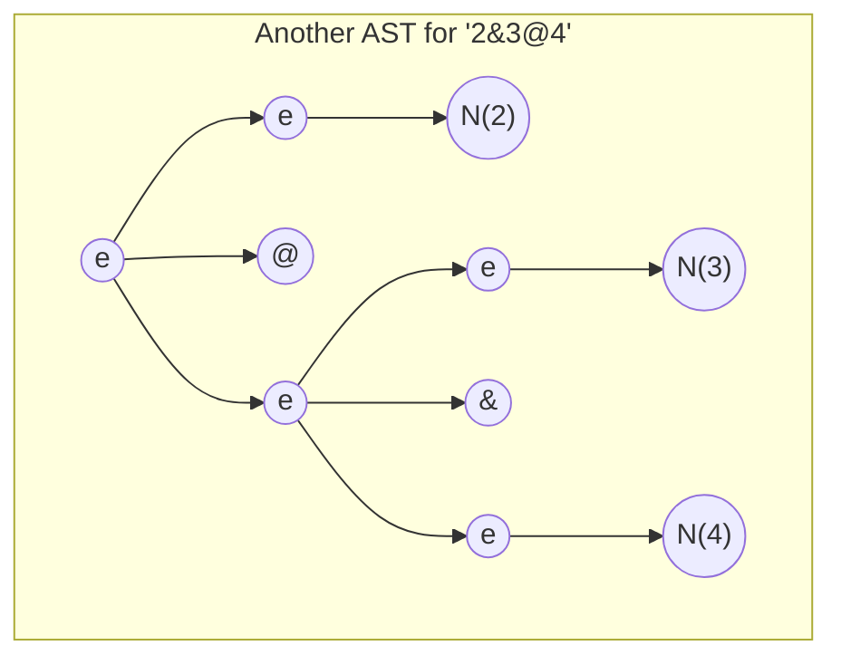

# Hello Compilers

Antes de emprender esta práctica, asegúrese de entender los dos ejemplos de parser generator en el repo [crguezl/hello-jison](https://github.com/crguezl/hello-jison). Los ejemplos incluyen 
1. Un evaluador de expresiones aritméticas de restas (ficheros `minus-ast.jison`, `minus.l` y `use-ast.js`) y 
2. Un traductor a JS de expresiones aritméticas de restas (ficheros `minus-ast.jison`, `ast-build.js`, `minus.l` y `use-ast.js`)


## Descripción de la Tarea

Let us consider a notation of arithmetic in which the `@` and `&` symbols on numbers are defined as the `max` and `min` operations. Thus, with this notation

$$12 @ 7=\max\{12,7\}=12$$ 

and

$$12 \& 7=\min\{12,7\}=7$$

Escriba un traductor de estas expresiones aritméticas a un programa JavaScript que las compute y las imprima.

Supondremos que el mínimo `&` tiene mas prioridad que el máximo `@`. Por ejemplo, la entrada $234 @ 325 \&  57$ debería ser traducida al siguiente código JS:

```js
console.log(Math.max(234, Math.min(325,57)))
```

Para ello 

1. Escriba un programa [Jison](/temas/syntax-analysis/analisis-LR/#introduccion-al-analisis-lr) que produzca un AST compatible Espree conteniendo el correspondiente código JS. A continuación 
2. Utilice [escodegen.generate(ast)](https://github.com/estools/escodegen) para generar el código JS

## Paréntesis

Añada paréntesis al lenguaje para que se pueda alterar la prioridad por defecto. Por ejemplo $$3\&(22@4) = 3$$ 
debería traducirse por:
   
```js
console.log(Math.min(3, Math.max(22, 4)));
```

## Challenge: Floats

Extend the regular expression in the lexical analyzer to cover floating point numbers like `2.53e-3` or `3e2`.

## Dealing with Ambiguity

You can extend the initial incomplete grammar in the assignment repo this way:

```
%{
const { buildLiteral, buildRoot, buildMin } = require('./ast-build');
%}

%%
es: e 
;

e: 
    e '@' e  
  | e '&' e  
  | N        
  | '(' e ')'
;
``` 

The problem with this grammar is that it is ambiguous. Expressions like `2&3@4`  have more than one concrete syntax tree.

On one side:



that will lead to the interpretation `2&(3@4)`; but we have also this other syntax tree:


that leads to the interpretation `(2&3)@4`.

Read the teacher notes on [precedence and associativity](http://crguezl.github.io/pl-html/node57.html) and see the examples in the [Repo crguezl/jison-prec](https://github.com/crguezl/jison-prec).

To break the ambiguity you  have to set that the precedence of the  token `&` is higher that the one of the token `@`. 

You have also to fix the ambiguity for phrases like `2&3&4` and `3@4@5` favouring a left associativity interpretation, i.e. preferring `(2&3)&4` to `2&(3&4)` and `(3@4)@5` to `3@(4@5)`.

### Breaking Ambiguity in Jison/Eyapp/Yacc/Bison et al. using token precedence 

These is a simplified version of the rules to resolve conflicts and ambiguities in a Yacc-like parser generator:

::: danger Precedence Rules
1. La precedencia de los tokens se hace en la cabecera del programa Jison; esto es: antes del primer `%%` usando la sintáxis `%left token ...` , `%right token ...` o `%nonassoc token ...`
2. La precedencia de una regla de producción $A \rightarrow \alpha$ es la precedencia del último token que aparece en la parte derecha $\alpha$ de la regla
   * Por ejemplo la precedencia de $e \rightarrow e @ e$ será la precedencia que le demos al token $@$
3. Cuando el parser detecta un conflicto y ve que hay dos posibles vias de continuar la construcción del árbol: Una que indica que quizá se aplicó la regla $A \rightarrow \alpha$ y otra que indica que quizá se pueda seguir leyendo el token $t$ a la entrada, 
   1. El parser compara las precedencias del token y de la regla y se queda con el de mas prioridad. 
   2. Si es el token quien tiene mayor prioridad avanzará en la lectura desplazando el token $t$ y buscando nuevos símbolos (se dice que hace un *shift*; en este caso probablemente el AST se "hundirá" a derechas) y 
   3. Si es la regla completará el subárbol parcial $\overset{A}{\overset{\triangle}{\alpha}}$ y continuará en su construcción del árbol (se dice que hace un *reduce* y en este caso el árbol construido estará más hundido a izquierdas)
4. Los tokens declarados en la misma línea mediante una declaración `%left` o `%right` 
tienen igual precedencia e igual asociatividad. 
3. La precedencia es mayor cuanto mas abajo su posición en el texto
:::

Así, en nuestro ejemplo deberíamos poner:

```
... 

%left @
%left &
%%
es: e 
;

...
```

## Pruebas

Añada [pruebas](/temas/introduccion-a-javascript/pruebas) usando [Mocha y Chai](/temas/introduccion-a-javascript/mocha) o [Jest](/temas/introduccion-a-javascript/jest)

!!!include(temas/introduccion-a-javascript/mocking-stubbing.md)!!!

## Covering 

You can use  [nyc](https://www.npmjs.com/package/nyc) to do the covering of your mocha tests.
See the notes in [covering](/temas/introduccion-a-javascript/covering). 

Activate the GitHub pages of your repo (use the default branch and the `docs` folder) and be sure to include your covering report in the `docs` folder.

## Continuous Integration

Añada Integración contínua usando GitHub actions.
Lea la sección [GitHub Actions](/temas/introduccion-a-javascript/github-actions) de los apuntes.


## References

* See the examples in the repo [crguezl/hello-jison](https://github.com/crguezl/hello-jison)
* [https://astexplorer.net](https://astexplorer.net)
* [JAVASCRIPT AST VISUALIZER](https://resources.jointjs.com/demos/javascript-ast) jointjs demos
* [Tipos de Nodos del AST](/temas/introduccion-a-pl/espree-visitorkeys)
* [Espree](https://github.com/eslint/espree)
  * [Options for parse and tokenize methods](https://github.com/eslint/espree#options)
* [Escodegen repo en GitHub](https://github.com/estools/escodegen)
  - [Escodegen API Doc](https://github.com/estools/escodegen/wiki/API)
* [Análisis Sintáctico Ascendente en JavaScript](http://crguezl.github.io/pl-html/node43.html)
* [Jison](/temas/syntax-analysis/analisis-LR/#introduccion-al-analisis-lr)
* [Jison Documentation](https://gerhobbelt.github.io/jison/docs//)
* [Folder jison/examples from the Jison distribution](https://github.com/zaach/jison/tree/master/examples)
* [Jison Debugger](https://nolanlawson.github.io/jison-debugger/)
* [Precedencia y Asociatividad](http://crguezl.github.io/pl-html/node57.html)
    - [Repo de ejemplo crguezl/jison-prec](https://github.com/crguezl/jison-prec)
* [Construcción de las Tablas para el Análisis SLR](http://crguezl.github.io/pl-html/node49.html)
* [Algoritmo de Análisis LR (yacc/bison/jison)](http://crguezl.github.io/pl-html/node55.html)
* [Repo ULL-ESIT-PL-1718/jison-aSb](https://github.com/ULL-ESIT-PL-1718/jison-aSb)
* [Repo ULL-ESIT-PL-1718/ull-etsii-grado-pl-jisoncalc](https://github.com/ULL-ESIT-PL-1718/ull-etsii-grado-pl-jisoncalc)
* <a href="https://medium.com/basecs/leveling-up-ones-parsing-game-with-asts-d7a6fc2400ff" rel="nofollow">Leveling Up One’s Parsing Game With ASTs</a> by <a href="https://twitter.com/vaidehijoshi" rel="nofollow">Vaidehi Joshi</a> * <em> 👍</em>

* [Lunar Arithmetic](https://en.wikipedia.org/wiki/Lunar_arithmetic)

