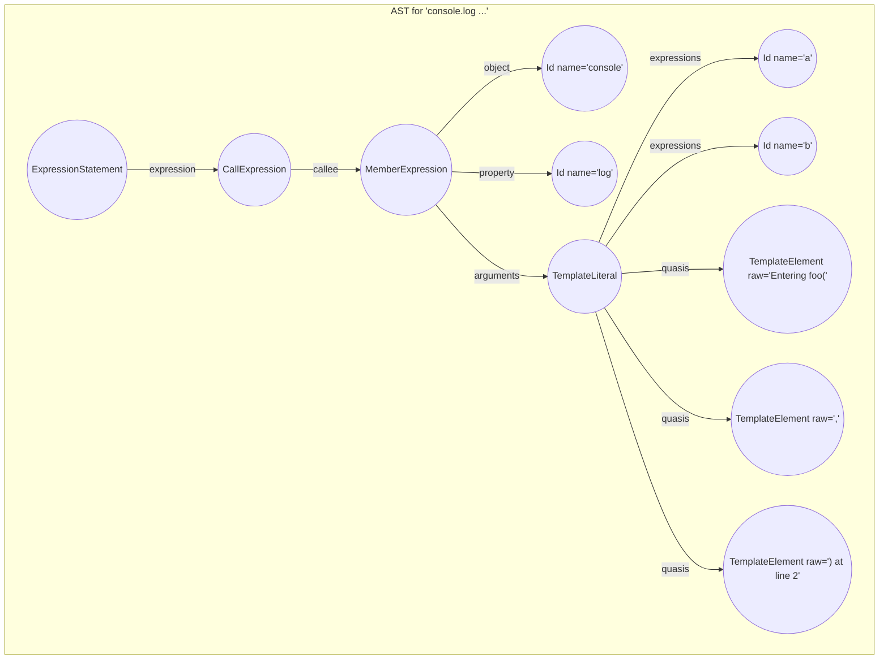

Here is the AST for 

```js
console.log(`Entering foo(${ a },${ b }) at line 2`);
```


```mermaid
graph TB
  subgraph AST for 'console.log ...'
    A((ExpressionStatement))-->|"expression"| B((CallExpression))
    B-->|"callee"| C((MemberExpression))
    C-->|"object"| D(("Id name='console'"))
    C-->|"property"| E(("Id name='log'"))
    C-->|"arguments"| F((TemplateLiteral))
    F-->|"expressions"| G(("Id name='a'"))
    F-->|"expressions"| H(("Id name='b'"))
    F-->|"quasis"| I(("TemplateElement raw='Entering foo('"))
    F-->|"quasis"| J(("TemplateElement raw=','"))
    F-->|"quasis"| K(("TemplateElement raw=') at line 2'"))

  end
```
