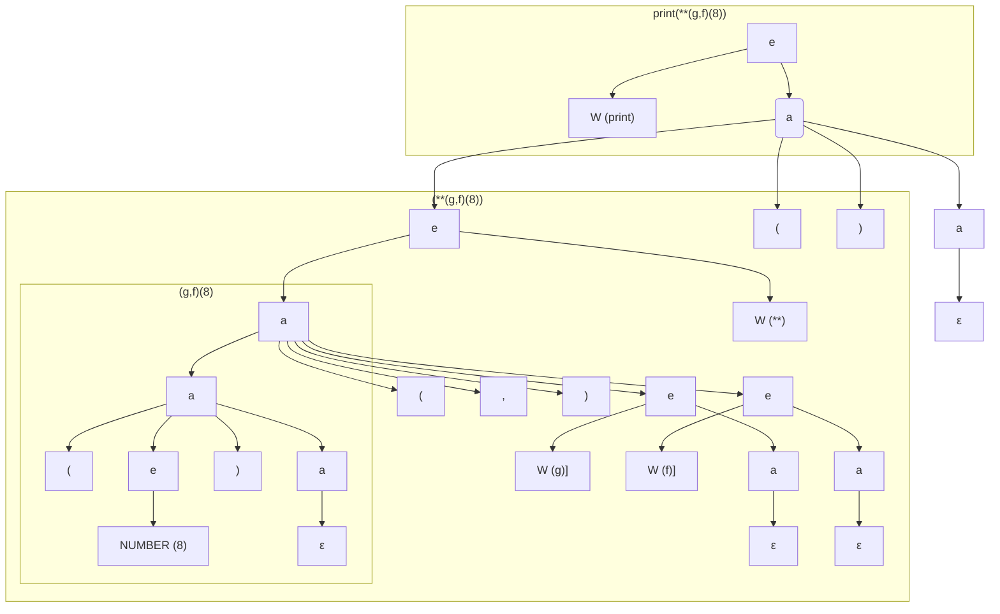

# Gramáticas y Lenguajes Generados

## Gramáticas Independientes del Contexto

Supongamos una gramática $G = (\Sigma, V, P, S)$ con alfabeto $\Sigma$, conjunto de variables sintácticas (o no terminales) $V$, reglas de producción $P$ y símbolo de arranque $S$.

Por ejemplo, en la gramática de Egg este es el conjunto $P$ de reglas de producción:

```yacc
expression: STRING
          | NUMBER
          | WORD apply

apply: /* vacio */
     | '(' (expression ',')* expression? ')' apply
```

Sólo hay dos variables sintácticas $V = \{ expression, \, apply \}$. El símbolo de arranque $S$ es $expression$.

El conjunto de tokens es:

$\Sigma = \{ STRING,\, NUMBER,\, WORD,\, '(',\, ')',\, ','  \}$

Observe que algunos de los tokens son a su vez lenguajes de cierta complejidad, cuya definición está en otro nivel de abstracción, **el nivel léxico** y que se pueden definir mediante un mecanismo 
mas secillo como son las expresiones regulares. 


Por ejemplo, en una definición de Egg inicial podríamos definir así lo que entendemos por **espacios** o **blancos**, esto es, que partes del texto no son significativas para que nuestro programa pueda entender la estructura de la frase:

```js
WHITES = /(\s|[#;].*|\/\*(.|\n)*?\*\/)*/
```

así como los tokens mas complejos:

```js
STRING = /"((?:[^"\\]|\\.)*)"/
NUMBER = /([-+]?\d*\.?\d+([eE][-+]?\d+)?)/
WORD   = /([^\s(),"]+)/
```

### Ejercicio

Construye una derivación para la frase

```
print(**(g,f)(8))
```

Observa que el resultado del análisis léxico sería un stream como este: 

```
WORD["print"] "(" WORD[**] "(" WORD[g] "," WORD[f] ")" "(" NUMBER[8] ")" ")"
```

**Solución**:

En la solución que sigue, 
abreviamos *expression* por $e$ , 
*apply* por $a$,
 *WORD* por $W$ y *NUMBER* por $N$:

$e \Longrightarrow  W [print] a$ (Aquí $e \longrightarrow W a$)

$\Longrightarrow W[print] (e) a$ (Ya que $a \longrightarrow  (e) a$)

$\Longrightarrow  W [print] (e)$ (Ya que  $a \longrightarrow \epsilon$)

$\Longrightarrow W[print] (W[\star\star] a)$ (Aquí hizo $e \longrightarrow W a$)

$\Longrightarrow W[print] (W[\star\star] (e, e) a )$  (Aquí hizo $a \longrightarrow (e, e) a$)

$\Longrightarrow W[print] (W[\star\star] (e, e) (e) a )$ (La última *a* hizo $a \longrightarrow  (e) a$)

$\Longrightarrow  W[print] (W[\star\star] (e, e) (e))$  (La última $a$ hace $\epsilon$)

$\overset{\star}{\Longrightarrow} W[print] (W[\star\star] (W[g], W[f]) (N[8]))$ (después de aplicar reiteradas veces las reglas)

En forma gráfica, tenemos el árbol sintáctico concreto que sigue:


Este es el mismo diagrama hecho usando [mermaid](https://mermaid-js.github.io/mermaid/#/):



## Lenguaje Generado por Una Gramática

Para cada variable sintáctica
$A \in V$ el lenguaje
generado desde la variable $A$ se define como:

$L_A(G) = \{ x \in \Sigma^\star: A \stackrel{\star}{\Longrightarrow} x \}$

Esto es, $L_A(G)$ es el conjunto de frases del alfabeto que **derivan** en varias substituciones desde la variable $A$. 

El lenguaje Egg es el conjunto de frases $L_{expression}(EggGrammar) = \{ x \in \Sigma^\star: expression \stackrel{\star}{\Longrightarrow} x \}$ donde $EggGrammar$ es la gramática definida arriba.

El problema a considerar es el de construir para un lenguaje  $L_A(G)$  una función `parseA()` que reconozca las frases del lenguaje   $L_A(G)$.

Siguiendo con el ejemplo de Egg, en $L_{apply}(EggGrammar)$ tenemos frases como:

* `()`
* `(4,b)` 
* `(4, +(5,c))`
* `(4,)`
* `/* nada */`

Recuerda que:

```
apply: /* vacio */ 
     | '(' (expression ',')* expression? ')' apply
```

y que:

$L_{apply}(EggGrammar) = \{ x \in \Sigma^* : apply \stackrel{*}{\Longrightarrow} x \}$

## ECMAScript A Complex Language Specification

This [Ecma Standard](https://tc39.es/ecma262/#sec-intro) **defines the ECMAScript 2022 Language**. 

It is the thirteenth edition of the ECMAScript Language Specification. Since publication of the first edition in 1997, ECMAScript has grown to be one of the world's most widely used general-purpose programming languages. It is best known as the language embedded in web browsers but has also been widely adopted for server and embedded applications.

Although ECMAScript started as a language with a simple design, with years that design has become more and more complex. The next section is just an illustration of how some language design decisions lead to a growth in complexity.

### Lexical Ambiguity Example

The source text of an ECMAScript is first converted into a sequence of input elements, which are 
* tokens, 
* line terminators, 
* comments, or 
* white space. 

The source text is scanned from left to right, repeatedly taking the longest possible sequence of code points as the next input element.

In ECMAScript, there are several situations where **the identification of lexical input elements is sensitive to the syntactic grammar context** that is consuming the input elements. 

This requires *multiple goal symbols* for the lexical grammar. The use of multiple lexical goals ensures that there are no lexical ambiguities that would affect **automatic semicolon insertion**. 

For example, there are no syntactic grammar contexts where both a leading division or division-assignment, and a leading [RegularExpressionLiteral](https://tc39.es/ecma262/#prod-RegularExpressionLiteral) are permitted. 

This is not affected by semicolon insertion (see [12.5](https://tc39.es/ecma262/#prod-RegularExpressionLiteral)); in examples such as lines 4 and 5 in the following code:

```js{4,5}
let tutu = { map(_) { return 2}}
let a = 5, b = 8, hi = 4, c = "hello", d =
    g = { exec(_) { return tutu; }}
a = b
/hi/g.exec(c).map(d)
console.log(a);
```   

where the first non-whitespace, non-comment code point after a [LineTerminator](https://tc39.es/ecma262/#prod-LineTerminator) is the `/` (*U+002F unicode name SOLIDUS*) and **the syntactic context allows division or division-assignment**, no semicolon is inserted at the `LineTerminator`!. 

That is, the above example is interpreted in the same way as:

```js
a = b / hi / g.exec(c).map(d);
```

When we run the code above, we get:

```
➜  prefix-lang git:(master) ✗ node examples/lexical-ambiguity.js
1
```

### ECMAScript Language: Grammar

* [A Grammar Summary](https://tc39.es/ecma262/#sec-grammar-summary) (Appendix with the whole grammar)
  * [Grammar Notation Explained](https://tc39.es/ecma262/#sec-grammar-notation)
* [[A.2] Expressions](https://tc39.es/ecma262/#sec-lexical-grammar "Expressions")
  * [13 ECMAScript Language: Expressions](https://tc39.es/ecma262/#sec-ecmascript-language-expressions)
* [[A.3] Statements](https://tc39.es/ecma262/#sec-statements "Statements")
  * [14 ECMAScript Language: Statements and Declarations](https://tc39.es/ecma262/#sec-ecmascript-language-statements-and-declarations)
* [[A.4] Functions and Classes](https://tc39.es/ecma262/#sec-functions-and-classes "Functions and Classes")
  * [15 ECMAScript Language: Functions and Classes](https://tc39.es/ecma262/#sec-ecmascript-language-functions-and-classes)
* [[A.5] Scripts and Modules](https://tc39.es/ecma262/#sec-scripts-and-modules "Scripts and Modules")
* [[A.6] Number Conversions](https://tc39.es/ecma262/#sec-number-conversions "Number Conversions")
* [[A.7] Universal Resource Identifier Character Classes](https://tc39.es/ecma262/#sec-universal-resource-identifier-character-classes "Universal Resource Identifier Character Classes")
* [[A.8] Regular Expressions](https://tc39.es/ecma262/#sec-regular-expressions "Regular Expressions")


### ECMAScript Language: Lexical Specification

* [[A.1] Lexical Grammar](https://tc39.es/ecma262/#sec-lexical-grammar "Lexical Grammar")
* [12 ECMAScript Language: Lexical Grammar](https://tc39.es/ecma262/#sec-ecmascript-language-lexical-grammar)
* [11 ECMAScript Language: Source Text](https://tc39.es/ecma262/#sec-ecmascript-language-source-code)

### ECMA TC39 at GitHub 

* Github Organization [Ecma TC39: Ecma International, Technical Committee 39 - ECMAScript](https://github.com/tc39/)
* [This Github repository contains the source for the current draft of ECMA-262](https://github.com/tc39/ecma262)