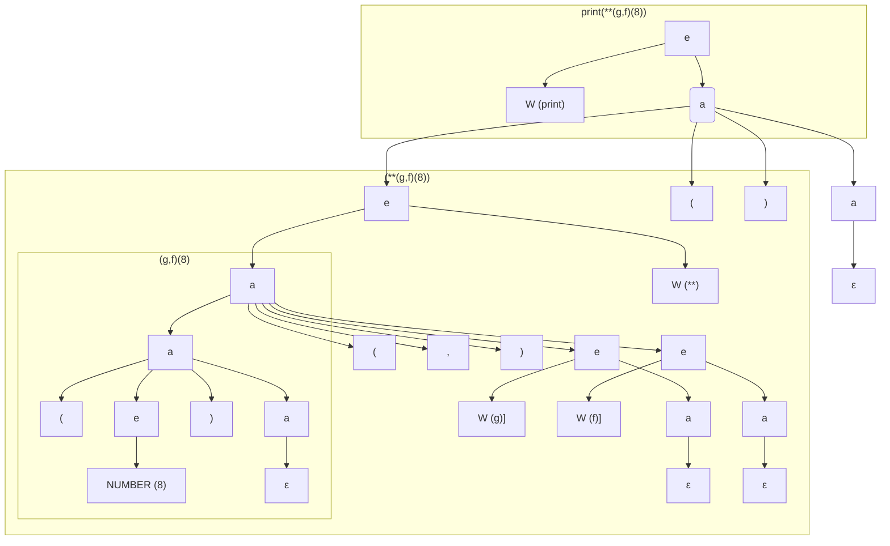

## Introducción A los Analizadores Sintácticos

Después de la fase de análisis léxico la siguiente fase en la construcción del analizador es la fase de
análisis sintáctico. Esta toma como entrada el flujo de terminales y
construye como salida el [árbol de análisis sintáctico abstracto](ast-description).

Existen diferentes métodos de análisis sintáctico. La mayoría caen en
una de dos categorías: 

1. ascendentes y 
2. descendentes. 
 
Los ascendentes
construyen el árbol desde las hojas hacia la raíz. 

Los descendentes lo
hacen en modo inverso. 

El que describiremos aquí es un descendente: se denomina **método de análisis predictivo descendente recursivo**.


## Gramáticas Independientes del Contexto {#gramaticas}

Supongamos una gramática $G = (\Sigma, V, P, S)$ con alfabeto $\Sigma$, conjunto de variables sintácticas (o no terminales) $V$, reglas de producción $P$ y símbolo de arranque $S$.

Por ejemplo, en la gramática de Egg este es el conjunto $P$ de reglas de producción:

```yacc
expression: STRING
          | NUMBER
          | WORD apply

apply: /* vacio */
     | '(' (expression ',')* expression? ')' apply
```

Sólo hay dos variables sintácticas $V = \{ expression, \, apply \}$. El símbolo de arranque $S$ es $expression$.

El conjunto de tokens es:

$\Sigma = \{ STRING,\, NUMBER,\, WORD,\, '(',\, ')',\, ','  \}$

Observe que algunos de los tokens son a su vez lenguajes de cierta complejidad, cuya definición está en otro nivel de abstracción, **el nivel léxico** y que se pueden definir mediante un mecanismo 
mas secillo como son las expresiones regulares. 


Por ejemplo, en una definición de Egg inicial podríamos definir así lo que entendemos por **espacios** o **blancos**, esto es, que partes del texto no son significativas para que nuestro programa pueda entender la estructura de la frase:

```js
WHITES = /(\s|[#;].*|\/\*(.|\n)*?\*\/)*/
```

así como los tokens mas complejos:

```js
STRING = /"((?:[^"\\]|\\.)*)"/
NUMBER = /([-+]?\d*\.?\d+([eE][-+]?\d+)?)/
WORD   = /([^\s(),"]+)/
```

### Ejercicio

Construye una derivación para la frase

```
print(**(g,f)(8))
```

Observa que el resultado del análisis léxico sería un stream como este: 

```
WORD["print"] "(" WORD[**] "(" WORD[g] "," WORD[f] ")" "(" NUMBER[8] ")" ")"
```

**Solución**:

En la solución que sigue, 
abreviamos *expression* por $e$ , 
*apply* por $a$,
 *WORD* por $W$ y *NUMBER* por $N$:

$e \Longrightarrow  W [print] a$ (Aquí $e \longrightarrow W a$)

$\Longrightarrow W[print] (e) a$ (Ya que $a \longrightarrow  (e) a$)

$\Longrightarrow  W [print] (e)$ (Ya que  $a \longrightarrow \epsilon$)

$\Longrightarrow W[print] (W[**] a)$ (Aquí hizo $e \longrightarrow W a$)

$\Longrightarrow W[print] (W[**] (e, e) a )$  (Aquí hizo $a \longrightarrow (e, e) a$)

$\Longrightarrow W[print] (W[**] (e, e) (e) a )$ (La última *a* hizo $a \longrightarrow  (e) a$)

$\Longrightarrow  W[print] (W[**] (e, e) (e))$  (La última $a$ hace $\epsilon$)

$\overset{*}{\Longrightarrow} W[print] (W[**] (W[g], W[f]) (N[8]))$ (después de aplicar reiteradas veces las reglas)

En forma gráfica, tenemos el árbol sintáctico concreto que sigue:


Este es el mismo diagrama hecho usando [mermaid](https://mermaid-js.github.io/mermaid/#/):



## Lenguaje Generado por Una Gramática

Para cada variable sintáctica
$A \in V$ el lenguaje
generado desde la variable $A$ se define como:

$L_A(G) = \{ x \in \Sigma^* : A \stackrel{*}{\Longrightarrow} x \}$

Esto es, $L_A(G)$ es el conjunto de frases del alfabeto que **derivan** en varias substituciones desde la variable $A$.

En los métodos de Análisis Sintáctico Descendente Recursivo (PDR) se asocia una subrutina con cada variable sintáctica
$A \in V$. 

La función de dicha subrutina (que de ahora en adelante llamaremos `parseA()`) es reconocer $L_A(G)$.

Siguiendo con el ejemplo de Egg, en $L_{apply}(EggGrammar)$ tenemos frases como:

* `()`
* `(4,b)` 
* `(4, +(5,c))`
* `(4,)`
* `/* nada */`

Recuerda que:

```
apply: /* vacio */ 
     | '(' (expression ',')* expression? ')' apply
```

y que:

$L_{apply}(EggGrammar) = \{ x \in \Sigma^* : apply \stackrel{*}{\Longrightarrow} x \}$

